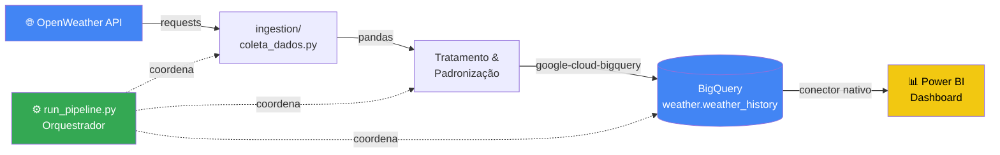

# 🌦️ GCP Weather Data Engineering Pipeline

<div align="center">


**Pipeline de engenharia de dados end-to-end para coleta, tratamento e análise de dados climáticos de Brasília (2020–2026) usando Python e Google Cloud Platform.**

[📊 Ver Dashboard](#-dashboard) · [⚙️ Como Executar](#-como-executar) · [🏗️ Arquitetura](#-arquitetura-do-pipeline) · [📈 Insights](#-insights-analíticos)

</div>

---

## 📌 Sobre o Projeto

Brasília apresenta um dos regimes climáticos mais extremos do Brasil — verões com chuvas intensas e invernos com seca severa e umidade abaixo de 20%. Este projeto constrói um **pipeline de engenharia de dados completo** para monitorar esses padrões de forma contínua, estruturada e escalável.

O problema real que esse pipeline resolve: **identificar e quantificar eventos climáticos críticos** — dias de calor extremo (acima de 35°C), períodos de umidade crítica e anomalias de precipitação — gerando uma base histórica confiável para análises de saúde pública, gestão hídrica e planejamento urbano no Distrito Federal.

**Aplicações reais:** os dados e insights gerados por esse pipeline têm uso direto em empresas como CAESB (gestão de reservatórios), SESDF (escala hospitalar em períodos críticos), CEB (previsão de pico de demanda energética) e Embrapa (calendário agrícola do Cerrado).

---

## 🏗️ Arquitetura do Pipeline



**Fluxo de dados:**

1. **Ingestão** — coleta de dados meteorológicos via OpenWeather API (temperatura, umidade, precipitação, vento, sensação térmica)
2. **Tratamento** — padronização de campos, tipagem, enriquecimento com timestamp UTC e metadados de localização
3. **Carga incremental** — inserção no BigQuery preservando histórico completo sem duplicatas
4. **Visualização** — dashboard interativo no Power BI conectado diretamente ao BigQuery

O pipeline é **modular e orquestrado** pelo `run_pipeline.py`, permitindo execução isolada de cada etapa ou do fluxo completo.

---

## 📊 Dashboard

> Análise climática de Brasília de 2020 a 2026 — KPIs, série histórica, mapa de calor mensal e indicadores de eventos extremos.


**Páginas e visões:**

| Visual | Descrição |
|---|---|
| KPIs principais | Temperatura máx/mín médias, umidade média, precipitação média |
| Alertas de extremo | Dias acima de 35°C e dias de umidade crítica por ano |
| Série histórica | TMax e TMin diárias de 2020 a 2026 com área sombreada |
| Mapa de calor | Temperatura máxima média por mês/ano com formatação condicional |
| Precipitação | Precipitação média mensal com sazonalidade do Cerrado |

**Filtros disponíveis:** Ano · Mês · Região Administrativa do DF

---

## 📈 Insights Analíticos

Os dados coletados de 2020 a 2026 revelam padrões climáticos significativos em Brasília:

### Tendência de aquecimento acelerado
O gráfico de TMax mostra elevação consistente ao longo da série. **2024 e 2025 concentram os maiores picos**, com 24 dias acima de 35°C em cada ano — o dobro do registrado em 2021 (9 dias). Isso não é anomalia pontual, é uma tendência crescente e quantificável.

### Sazonalidade extrema e risco duplo em julho
Junho e julho combinam simultaneamente: precipitação próxima de zero, umidade abaixo de 20% e temperaturas elevadas. Essa combinação representa o maior risco para saúde pública, consumo hídrico e incêndios no Cerrado.

### 2023 como ano de referência positiva
Apenas 3 dias acima de 35°C e baixo índice de umidade crítica fazem de 2023 o ano mais ameno da série. Isso evidencia **alta variabilidade interanual** — o que reforça a necessidade de monitoramento contínuo em vez de depender de médias históricas estáticas.

### Concentração de chuvas em 3 meses
Outubro, novembro e dezembro respondem pela maior parte das precipitações anuais. Fora desse trimestre, Brasília opera em regime de seca prolongada — dado crítico para planejamento de abastecimento e gestão de reservatórios como o Descoberto e Santa Maria.

### Umidade crítica acumulada: 97 dias
No período total (2020–2026), foram registrados **97 dias com umidade abaixo do limiar crítico** — concentrados entre maio e setembro. Em cada um desses dias, o risco de doenças respiratórias, incêndios e estresse hídrico é significativamente elevado.

---

## 🏢 Aplicações em Ambiente Empresarial

Este pipeline e seus dados têm valor direto nos seguintes setores:

**Saneamento e recursos hídricos (CAESB, ADASA, ANA)**
Monitorar precipitação e evaporação para prever nível de reservatórios, suportar planos de racionamento hídrico e gerar relatórios automáticos de condições hidrológicas.

**Saúde pública (SESDF, UPAs, hospitais regionais)**
Correlacionar dias de calor extremo com picos de atendimento por doenças respiratórias, AVC e desidratação. Planejar escala de equipes nos meses críticos baseada no histórico climático.

**Energia e infraestrutura (CEB, Neoenergia, energia solar)**
Prever picos de demanda energética em dias de calor extremo para gestão de carga. Calcular eficiência de geração solar baseada na irradiação histórica de Brasília.

**Agronegócio e meio ambiente (Embrapa, IBAMA, cooperativas)**
Construir calendário agrícola baseado em séries históricas reais. Monitorar risco de incêndio em áreas do Cerrado combinando umidade crítica, temperatura e velocidade do vento.

---

## 🗂️ Estrutura do Projeto

```
gcp-weather-data-engineering/
│
├── ingestion/              # Coleta e tratamento de dados da API
│   └── coleta_dados.py
│
├── load/                   # Carga incremental no BigQuery
│   └── load_bigquery.py
│
├── sql/                    # Queries auxiliares e criação de tabelas
│   └── create_table.sql
│
├── docs/                   # Imagens e documentação adicional
│   └── dashboard_preview.png
│
├── run_pipeline.py         # Orquestrador principal do pipeline
├── run_pipeline.bat        # Script de execução para Windows
├── requirements.txt        # Dependências do projeto
├── .env.example            # Modelo de variáveis de ambiente
├── .gitignore
└── README.md
```

---

## 🛠️ Tecnologias

| Camada | Tecnologia | Função |
|---|---|---|
| Ingestão | Python 3.11 + requests | Consumo da OpenWeather API |
| Tratamento | pandas + python-dotenv | Padronização e enriquecimento |
| Armazenamento | Google BigQuery | Data warehouse com carga incremental |
| Autenticação | Google Cloud SDK | Autenticação e acesso ao GCP |
| Visualização | Power BI Desktop | Dashboard analítico interativo |
| Versionamento | Git + GitHub | Controle de código e colaboração |

---

## ⚙️ Como Executar

### Pré-requisitos

- Python 3.11+
- Conta Google Cloud com projeto e dataset BigQuery criados
- Chave de API da [OpenWeather](https://openweathermap.org/api) (plano gratuito suficiente)
- [Google Cloud SDK](https://cloud.google.com/sdk/docs/install) instalado

### 1. Clonar o repositório

```bash
git clone https://github.com/RafaelCL94/gcp-weather-data-engineering.git
cd gcp-weather-data-engineering
```

### 2. Criar e ativar ambiente virtual

```bash
python -m venv venv

# Windows
venv\Scripts\activate

# Linux / Mac
source venv/bin/activate
```

### 3. Instalar dependências

```bash
pip install -r requirements.txt
```

### 4. Configurar variáveis de ambiente

```bash
cp .env.example .env
# Edite o .env com sua chave de API e configurações do projeto GCP
```

```env
OPENWEATHER_API_KEY=sua_chave_aqui
GCP_PROJECT_ID=seu_projeto_id
BQ_DATASET=weather
BQ_TABLE=weather_history
CITY=Brasilia
```

### 5. Autenticar no Google Cloud

```bash
gcloud auth login
gcloud auth application-default login
gcloud config set project SEU_PROJECT_ID
```

### 6. Executar o pipeline

```bash
# Execução completa (ingestão → tratamento → carga)
python run_pipeline.py

# Windows
run_pipeline.bat
```

---

## 🗄️ Schema da Tabela BigQuery

Tabela: `weather.weather_history`

| Campo | Tipo | Descrição |
|---|---|---|
| cidade | STRING | Nome da cidade monitorada |
| pais | STRING | Código do país (BR) |
| temperatura | FLOAT | Temperatura atual (°C) |
| temp_min | FLOAT | Temperatura mínima do dia (°C) |
| temp_max | FLOAT | Temperatura máxima do dia (°C) |
| sensacao_termica | FLOAT | Sensação térmica (°C) |
| umidade | INTEGER | Umidade relativa do ar (%) |
| pressao | INTEGER | Pressão atmosférica (hPa) |
| vento_velocidade | FLOAT | Velocidade do vento (m/s) |
| condicao | STRING | Condição climática (Clear, Rain...) |
| latitude | FLOAT | Latitude da estação |
| longitude | FLOAT | Longitude da estação |
| coletado_em | TIMESTAMP | Timestamp da coleta (UTC) |

---

## 🚀 Próximas Evoluções

- [ ] Índice de calor (heat index) combinando temperatura + umidade para alertas de saúde pública
- [ ] Expansão para múltiplas Regiões Administrativas do DF (Ceilândia, Taguatinga, Sobradinho)
- [ ] Modelo preditivo com Prophet para projeção de temperatura e precipitação
- [ ] Agendamento automático com Apache Airflow via Docker Compose
- [ ] Cruzamento com dados de internações hospitalares do DATASUS para análise de impacto em saúde

---

## 👤 Autor

**Rafael Cunha Lima**
Engenharia de Dados | Python | GCP | BigQuery | Power BI

[](https://www.linkedin.com/in/rafael-lima94)
[](https://github.com/RafaelCL94)

---

> Pipeline construído com dados reais da OpenWeather API, arquitetura orientada a produção e análise aplicada ao contexto climático do Distrito Federal.
